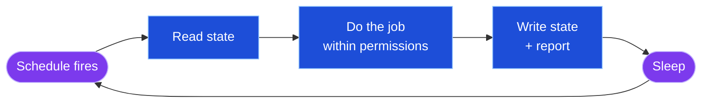
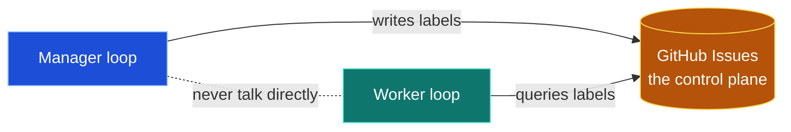

<!-- VENDORED VERBATIM from Owain Lewis. Source: https://github.com/owainlewis/youtube-tutorials/blob/main/tutorials/loop-engineering/README.md. Captured: 2026-06-22. Do not edit; this is upstream reference. -->

# Loop Engineering: A Practical Example

You may have heard a lot of hype around the term loop engineering, but very few people show you how to apply the concept in practice.

That is what this lesson is going to do.

Most of us dream about having autonomous agents that run 24/7, doing work for us, making us money, and saving us time.

But in reality, building systems like these requires real design thinking.

I am going to show you how I am using Claude Code and Codex to automate part of my development process.

By the end, you will know exactly how these autonomous agent systems work and how to build them yourself.

And even if you're not a software engineer, all of the ideas and principles we discuss here apply equally well to other domains in your business.

All of the resources, skills, and prompts are included along the way.

So let's get into it.

---

Right now, while you're reading this, there are AI agents working inside my project. They're reviewing the backlog, writing tickets, and deciding what's safe to work on, and then picking up issues, fixing them, and opening pull requests. 24/7. Unattended. I wake up to work that's already been done.

This is what everyone is suddenly calling **loop engineering**. [Peter Steinberger](https://x.com/steipete/status/2063697162748260627) recently tweeted:

> "Here's your monthly reminder that you shouldn't be prompting coding agents anymore. You should be designing loops that prompt your agents."

And Boris Cherny, the creator of Claude Code, has landed in the same place:

> "I don't prompt Claude anymore. I write loops, and the loops do the work. My job is to write loops."

When the person who built Claude Code and one of the most prolific agent power users converge on the same idea, it's worth paying attention. So this is the full, working example: how the system works, why it works, and the engineering thinking that goes into it. And here's the spoiler: the secret isn't smarter agents. It's that we're *not* letting agents take over everything. We're giving them very defined roles and letting them act autonomously within boundaries. That, more than anything else, is what makes all of this work.

---

## What a loop actually is

A loop is a job an agent does on repeat: it wakes up on a schedule, reads the current state of the work, does one specific job within fixed permissions, writes the results back, and goes to sleep. Then it happens again. No one kicks it off, and no one is watching while it runs.



So every loop has four parts:

```
JOB         what it owns
PERMISSIONS what it may change
SCHEDULE    when it wakes up
STATE       shared, outside the chat
```

That's all the jargon we need. An autonomous agent is a single run without you. A loop is the recurring version: an agent plus a job, permissions, a schedule, and shared state. Loop engineering is everything you design *around* the agent so the loop doesn't make a mess.

And here's the part the hype skips: most of a good loop isn't AI. A schedule is a cron job. Labels are access control. PR review is an approval gate. In my whole system, the LLM makes exactly two kinds of judgement: classifying tickets and writing code. Everything else is ordinary, deterministic software. That ratio is where the reliability comes from.

## Start with the control plane, not the agent

If you want agents running your development flow end to end, the first thing you need isn't an agent. It's one central place where all of the work is managed.

I use GitHub Issues. Every piece of work is a ticket. Agents and humans collaborate on the same work items, and at all times you can see exactly what the agents are doing: what they picked up, what they changed, what they decided. Without that visibility, you basically have chaos.

I call this the **agent control plane**, because "memory" undersells it. Yes, it's how agents remember things between runs (the agent forgets everything, the repo doesn't). But its real job is coordination. The loops in my system never talk to each other. One writes labels; the other queries them.



Labels are the protocol. My label system is deliberately small:

```
RISK      risk:low | risk:medium | risk:high
TYPE      bug | feature | docs | test | refactor | chore
ROUTING   agent:ready    ← permission to pick up
          needs:human    ← "this needs Owain"
```

The one to understand is `agent:ready`. It's not a tag, it's a **permission grant**. An agent may only work on a ticket that carries it. The whole system is an access-control layer expressed as labels, and the risk labels are the dial: by default only `risk:low` work routes to agents. If I want to widen that, it's a policy I change explicitly. The system never widens its own permissions.

## Loop 1: the manager

The first loop does the job an engineering manager or tech lead does: keep the backlog organised so the team can pick up work.

I used to do this job as a human. Labelling tickets, setting priorities, deciding what's ready and who it's for, fixing the board when it drifts out of date. The work genuinely matters, and it's mechanical, laborious, and time-consuming. That's exactly the profile of work agents are good at. So the first thing I built wasn't a coding agent. It was the manager.

On each run, the manager loop:

1. Reads every open issue, the board, and linked pull requests.
2. Classifies each ticket: risk, type.
3. Marks work that is low-risk, non-ambiguous, and needs no human judgement as `agent:ready`.
4. Marks anything that needs judgement as `needs:human`, with a specific question.
5. Fixes drift: closed work still marked In Progress, open issues missing from the board.
6. Leaves an **Agent Assessment** comment on each classified ticket.

The assessment is the most useful output, because it makes every decision inspectable:

```
## Agent Assessment

Risk: low
Type: docs
Agent-ready: yes

Reason: README onboarding text only. Small, isolated,
verified by reading the rendered README.
```

I can read that, disagree, and flip the label in seconds. And the worker loop inherits the context when it picks the ticket up.

### Two ways to run it

You don't need any special infrastructure for this loop. There are two good options, and they're the same loop with a different trigger:

- **A GitHub Action.** A scheduled workflow that runs the triage prompt with Claude Code or Codex. Serverless, free, runs even when your laptop is closed, and you can trigger it manually from the Actions tab for a demo. If you just want the loop, start here.
- **An AI assistant like Hermes.** An always-on agent running the same job on a schedule. What you gain is a manager you can talk to: it can message you when something hits `needs:human` instead of waiting for you to check the board, and you can ask it *why* it made a call. The scheduler and the assistant are the same agent.

Either way, the output is identical: a clean, labelled queue.

### Dry run first, always

Before I let any loop change anything, I check its judgement. The pattern is: inspect everything, change nothing, report exactly what you would do.

```
Use the backlog-manager skill in DRY-RUN mode.

Repo: owainlewis/neo, project board #8.

Goal: inspect the backlog. Change NOTHING.

Report:
- missing labels
- open issues missing from the board
- closed work still marked In Progress
- which issues you'd mark agent:ready, and why
- which issues need a human, and why

Rules: no edits, no comments, no labels, no code, no PRs.
End with the exact actions you would take in apply mode.
```

What I'm grading: if it marks everything low-risk, the judgement is broken. If it wants to mark vague architecture work `agent:ready`, the judgement is broken. If it keeps high-risk work human-led and asks specific questions, it's working. Only then does it get apply mode, with scoped permissions: labels, comments, and board state. Never code, never PRs, never merges, never closing issues without merged-PR evidence.

## Loop 2: the worker

The second loop pulls one ready ticket off the queue and turns it into a pull request.

The rule is simple: only tickets labelled both `risk:low` and `agent:ready`. One issue, one thread, one branch, one worktree, so a failure stays disposable. For each ticket:

```
read the issue and its Agent Assessment
make a short plan
create a fresh branch
implement the change
run the tests
ask a subagent to review the diff
fix valid findings, run the tests again
open a pull request
comment back on the issue with the PR link
```

The review step matters more than it looks. The agent that wrote the code must not be the only one judging it; the model that wrote the code is too kind to it. A separate review agent checks the diff against the ticket before the PR opens. Maker and checker are different agents, and the final approver is me.

There's one enhancement that makes the whole system feel alive: **the loop feeds itself.** As the agents work, they find things: broken doc links, stale commands, skipped tests, small bugs. They don't fix them on the spot, because that would widen scope. They file evidence-backed tickets. The manager triages those tickets on its next run, and the safe ones flow back to the worker. Code problems become tickets become pull requests, without anyone asking.

## The guardrails

Let's be honest about why "just let the agent run" doesn't work. Hand full control to an agent and the failures are predictable: vague goals get filled with confident guesses, loops get stuck with no way to ask for help, expensive models burn tokens on cheap work, and the agent grades its own homework. Unless you're making throwaway prototypes, quality collapses.

So the system is built from guardrails, and each one is boring on purpose:

- **Only low-risk, non-ambiguous work routes to agents.** Everything else waits for a human.
- **The manager never writes code. The worker never chooses its own work.** Each loop has one job and the permissions for that job only.
- **A separate agent reviews every diff.** Maker and checker are never the same agent.
- **Nothing merges without a human.** The system opens pull requests. It never merges them. I review everything that ships.

Notice what these guardrails buy you: you don't have to *trust* the agents. Wrong label? Change it, seconds. Bad PR? Close it, nothing merged. Design for reversibility and mistakes become cheap and visible instead of rare and catastrophic.

They also set the system's speed limit: it can't go faster than I can review pull requests. That's not a limitation. It's the governor that keeps quality from collapsing.

Because quality is the north star here. Our goal is to explore what's possible with agents, but the goal is not to vibe-code. The goal is systems that consistently produce high-quality code and make us more effective as engineers. We never merge code that isn't high quality. That's why this is a systems-thinking problem: the agents follow the same practices a good team follows, and there's a check at every step to enforce them.

## Putting it together

Strip everything away and the whole system is a chain of transformations:

```
messy backlog       →  manager  →  labelled, routed queue
agent-ready ticket  →  worker   →  pull request
pull request        →  me       →  merged code
```

Here's what that looks like on an ordinary morning. Overnight, the manager ran: it labelled fourteen tickets, marked three `agent:ready`, flagged two as `needs:human` with specific questions, and moved two stale issues to Done. The worker picked up a README fix and a missing test, and opened two pull requests, each with passing tests and a review trail. I read two assessments, review two PRs, merge one, send one back, and answer the two questions. Twenty minutes of judgement on top of hours of mechanical work that happened while I slept.

Every arrow in that chain is a boundary where evaluation happens. Labelled tickets can be audited. Pull requests can be reviewed. Nothing flows through the system unobserved, and the last function is always me.

## Copy this

Don't start by copying my labels, and don't start with the tool. Start with the job. Write this card before you build anything:

```
JOB:        what does this agent own?
INPUTS:     what does it inspect?
ALLOWED:    what may it change?
FORBIDDEN:  what must it never do?
OUTPUT:     what exists after a good run?
EVALUATION: how do I know it did well?
```

The forbidden list is the most important part, and the evaluation line is the one people skip. If you can't answer "how would I know the agent did this job well?", you're not ready to run it autonomously. "Act as my assistant" fails this card: no input, no output, no boundary, nothing to grade.

And start with the manager loop alone. Even if no agent ever writes a line of code, a self-maintaining, risk-classified backlog is worth running, and it answers the hard question in autonomous coding, which was never "can agents write code?" It's "which work is safe to hand over?"

## Try it

Ten minutes, one repo:

1. Create four labels: `risk:low`, `risk:high`, `agent:ready`, `needs:human`.
2. Run the dry-run prompt above against your backlog with whatever agent you use.
3. Read the report. Did it keep risky work away from agents? Did it ask specific questions where judgement is needed?

Don't let it change anything yet. You're grading its judgement, not its output. When the judgement is right three runs in a row, give it apply mode.

---

That's loop engineering without the hype: two small loops, one control plane, and a human who still owns every merge. The engineering isn't in the agents. It's in the boundaries. I've delegated the implementation. I haven't delegated the accountability.

That's what makes it boring enough to run while I sleep. And boring is the goal.

